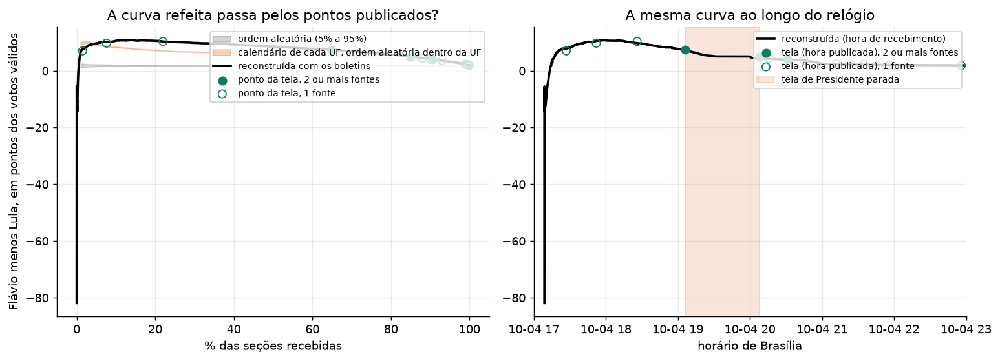
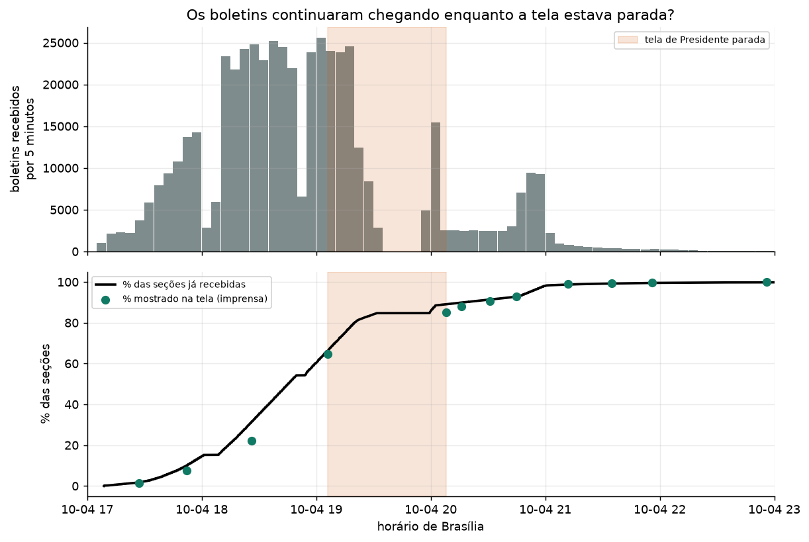
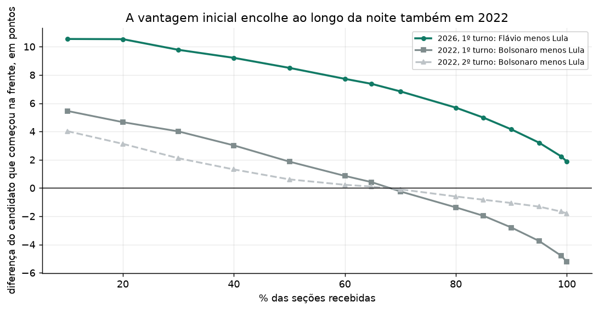
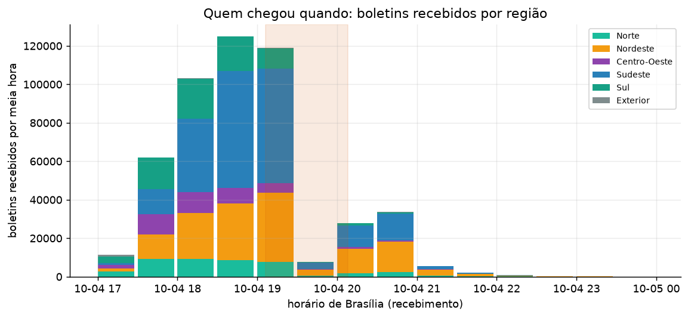
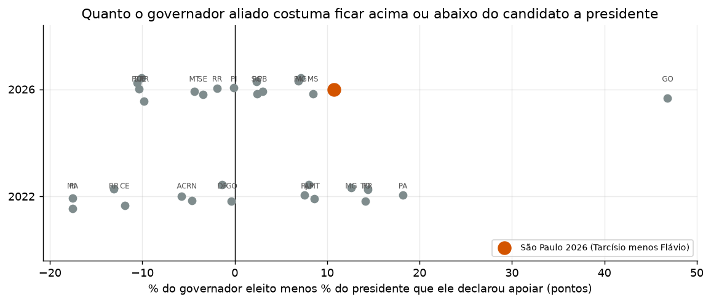
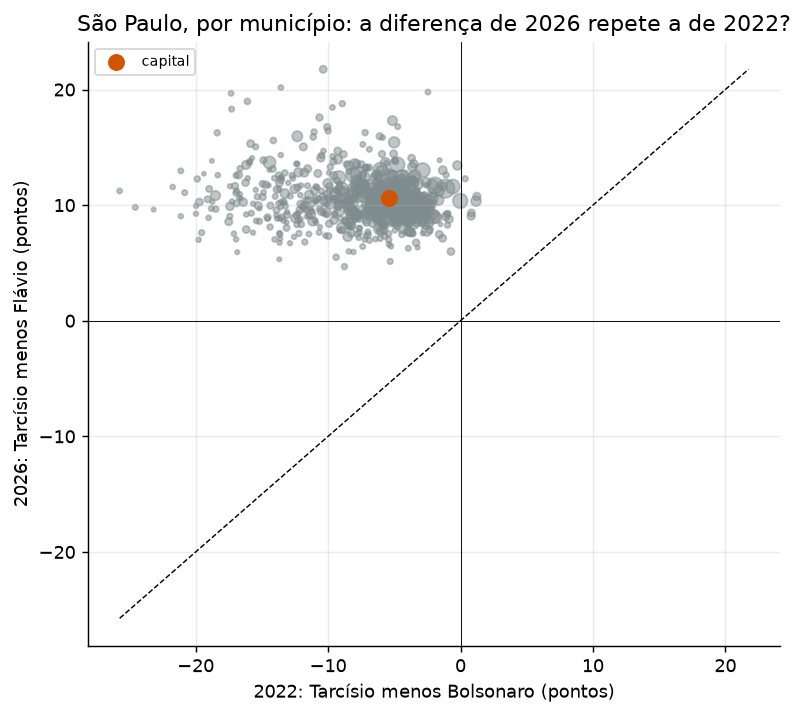
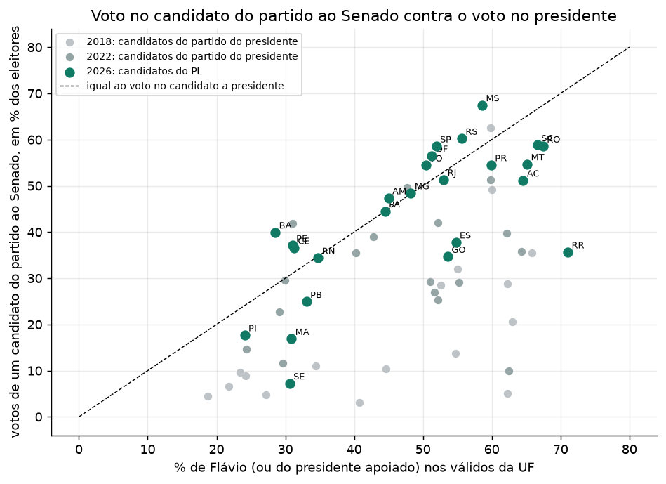
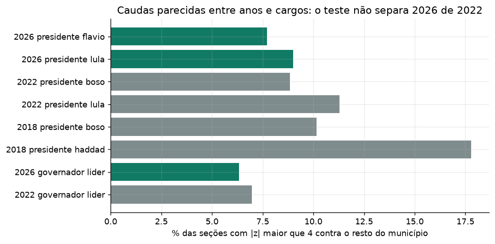

# A noite de 4 de outubro de 2026, refeita com os boletins de urna

**Projeto aberto, escrito com IA e com os critérios gravados antes dos testes.** Cada número deste relatório sai de um script rodado sobre arquivo público. O conjunto completo está em `resultados/RESUMO.json`, e os passos para refazer estão em [`docs/REPLICAR.md`](docs/REPLICAR.md).

> **Quem escreveu.** A análise foi feita por uma IA (Claude), sob a direção do autor do repositório, que definiu o objetivo e a régua. A revisão adversarial é uma segunda passada da própria IA, registrada em [`docs/REVISAO_ADVERSARIAL.md`](docs/REVISAO_ADVERSARIAL.md). **Nenhuma pessoa revisou os resultados antes desta publicação.**

---

## 0. Em resumo

1. **Os boletins publicados pelo TSE refazem o resultado oficial.** Foram decodificadas 499.192 seções, sem nenhum erro de leitura. Em 16.852 das 16.858 comparações por município e cargo (99,96%), a soma dos boletins é igual ao resultado oficial, voto por voto. A diferença que sobra vem de 15 seções cujos arquivos o TSE não publicou (3 em Minas Gerais, 12 em São Paulo): 3.935 votos de Presidente, 0,0033% dos válidos.
2. **A curva da noite refeita com a hora de recebimento passa pelos pontos que a imprensa publicou.** Encaixam 13 dos 14 pontos, o erro mediano é de 0,009 ponto percentual, e os três pontos que têm duas ou mais fontes encaixam todos. O ponto que não encaixa, com 7,6% das seções, fica a 0,24 ponto.
3. **Não houve troca de liderança.** Depois dos primeiros 0,45% das seções, Flávio Bolsonaro esteve sempre à frente de Lula nos votos válidos. A diferença foi de 10,78 pontos no pico (às 17:58, com 14% das seções) até 1,87 no fim.
4. **A queda da diferença tem uma causa de calendário: quais regiões chegaram quando.** A composição regional do lote que chegou depois dos 64,81% explica 69% da diferença entre esse lote e o que já tinha chegado (78% por estado e capital). Capital contra interior, porte do município e tamanho da seção explicam praticamente nada. Em 2022, a mesma conta dá 67%.
5. **A parada de cerca de uma hora na tela de Presidente tem duas partes.** A tela congelou às 19h06 e voltou às 20h08, e os boletins refeitos reproduzem o que ela mostrou nos dois momentos. No registro de recebimento existe um vazio de 27,5 minutos sem nenhum boletim (das 19:31:50 às 19:59:22), 3,7 vezes o maior vazio de 2022, e uma rajada de 20.171 boletins nos 6 minutos seguintes, de urnas que haviam emitido o boletim mais de uma hora antes. **A causa dentro do sistema do TSE não é verificável com dados públicos.**
6. **São Paulo: a diferença entre Tarcísio e Flávio é de 10,7 pontos e aparece em todos os 645 municípios.** Tarcísio, apoiador declarado de Flávio, teve 62,65% dos válidos; Flávio, 51,93%. Quase metade dessa diferença (45%) vem de uma conta de base: 87,5% de quem compareceu votou em candidato a governador (voto válido), contra 94,1% para presidente. Em percentual de quem compareceu, Tarcísio tem 54,8% e Flávio 48,9%. Diferenças desse tamanho entre o governador aliado e o candidato a presidente que ele apoia ocorreram em outros estados em 2022 e em 2026. A estimativa ecológica é que cerca de 87% dos eleitores de Tarcísio votaram em Flávio.
7. **Senado: os 19 senadores eleitos pelo PL estão todos em estados onde Flávio ficou na frente.** Nos 12 estados em que Lula ficou na frente ou empatou, o PL elegeu zero. O voto por município no candidato do PL ao Senado acompanha o voto em Flávio (0,79) tanto quanto em 2022 (0,65) e 2018 (0,70). O critério escrito antes dos testes marca 8 estados como "a explicar", por motivos que a §7 descreve.
8. **Nenhum município passou nos três testes de anomalia ao mesmo tempo**, para Flávio, para Lula e no placebo de 2022.

---

## 1. O que este relatório não consegue dizer

- **Não audita o software nem o hardware da urna.** O projeto começa no boletim que cada urna imprimiu e publicou. Se o voto foi gravado errado dentro da urna, este trabalho não vê.
- **Não vê o sistema interno do TSE.** A causa técnica da parada só pode ser confirmada pelo registro interno do sistema, que não é público. O projeto mede o efeito da parada, não a causa.
- **Não sabe como cada pessoa votou.** O voto é secreto. Toda comparação entre cargos é feita por seção ou município, e qualquer afirmação sobre "quem votou em quem" é inferência ecológica, que pode errar.
- **Não verifica a assinatura digital dos boletins.** Testei se o hash que vem dentro do `bu.dat` seria o SHA-256, o SHA-512 ou o SHA3-512 do conteúdo dos votos, em cinco recortes diferentes, e nenhum bateu. A especificação pública da verificação não foi encontrada. Fica registrado como **não verificado**.
- **Não tem as telas da noite.** O TSE sobrescreve o arquivo a cada atualização. A série de telas foi substituída pela reconstrução com a hora de recebimento, conferida contra 14 pontos publicados pela imprensa. Só 3 deles têm duas ou mais fontes, e um traz votos absolutos.
- **A hora de recebimento é a que o TSE registrou, e não sabemos o que ela mede por dentro.** Pode ser a chegada do arquivo ou o momento em que o sistema o processou. A §4 mostra por que isso importa.

**A régua do texto.** "Consistente com" e "não explicado por". O relatório não afirma que houve irregularidade comprovada nem que a ausência dela ficou provada. Um resultado consistente quer dizer que os dados públicos fecham entre si. Um resultado não explicado vira uma pergunta específica, com endereço (seção, horário, cargo), para quem tem acesso ao que é interno.

**Como lemos alinhamento político.** Por **apoio declarado**, com fonte, e não por partido. Tarcísio é do Republicanos e declarou apoio incondicional a Flávio em 31/jul/2026 (duas fontes capturadas). Uma diferença entre o voto de um aliado e o de Flávio pode indicar algo, e também pode ser voto dividido, efeito de quem já está no cargo ou rejeição diferente de cada nome. O relatório mede o tamanho da diferença contra casos comparáveis e não atribui causa.

---

## 2. Os dados e a verificação

**O que foi coletado.** Para cada seção de 2026, o TSE publica a hora em que o boletim foi recebido (`aux.json`) e o boletim em si (`bu.dat`). Foram baixados e guardados com hash 499.192 boletins de seções com votos. O total oficial é de 499.248 seções próprias, das quais 41 não foram instaladas (todas no exterior), e 17.931 seções agregadas têm os votos dentro da seção principal. Nenhuma seção tem mais de um boletim (0 seções com duplicidade). Em 31 seções (2 em Minas Gerais e 29 no exterior) o arquivo vem como `busa.dat`, o boletim do Sistema de Apuração, e foi lido da mesma forma.

**Decodificação.** Zero erros de leitura. Nas 499.161 seções com boletim comum, o comparecimento do cabeçalho é igual à soma dos votos de Presidente.

**Confronto com o resultado oficial.**

| Cargo | UFs comparadas | UFs com diferença | Votos sem correspondência |
|---|---|---|---|
| Presidente | 28 | 2 | 3.935 |
| Governador | 27 | 2 | 3.642 |
| Senador | 27 | 2 | 6.779 |

Em nível de município, 16.852 de 16.858 linhas são exatas. As diferenças estão em 2 municípios: MG-41335 e SP-63134, exatamente onde ficam as 15 seções sem arquivo publicado. A soma é consistente: o total de válidos reconstruído fica 3.935 votos abaixo do oficial (119.296.853 contra 119.300.788), e essa é a soma exata das diferenças nominais dos dois municípios. Flávio fica 1.757 votos abaixo do oficial e Lula 1.746.

**Candidatos fora da lista oficial.** O arquivo oficial trata como nulos os votos de candidaturas sem registro válido. A validação mostrou que o nulo oficial é igual ao nulo dos boletins mais esses votos (276.831 votos nos três cargos). Todas as análises abaixo contam esses votos como nulos, como o TSE.

**Fuso horário.** A hora de recebimento está em horário de Brasília em 27 das 28 unidades; o exterior (seções em vários países) não tem decisão possível. A regra é por município, porque o relógio de poucas urnas está fora do padrão: três municípios de Mato Grosso gravaram o encerramento em horário de Brasília, e Fernando de Noronha usa um fuso à frente. A leitura literal do critério (que moveria todo Mato Grosso uma hora) piora o encaixe dos pontos publicados, de 13 para 10, e muda a margem em até 0,87 ponto. A emenda está em `docs/PRE_REGISTRO.md`, §9.

---

## 3. A curva da noite: cada número da tela é a soma de boletins que já tinham chegado?

Ordenei todas as seções pela hora de recebimento e somei os votos na ordem. Para cada percentual de seções que a imprensa publicou, comparei os percentuais de Flávio e de Lula da tela com os da curva refeita, aceitando qualquer ponto da curva até 0,5 ponto de distância no percentual de seções e 0,1 ponto de diferença nos percentuais dos candidatos.

| Ponto | % das seções | Flávio publicado | Flávio refeito | Lula publicado | Lula refeito | Melhor erro na janela (pontos) | Encaixa | Fontes |
|---|---|---|---|---|---|---|---|---|
| P01 | 1,50 | 49,20 | 49,56 | 42,20 | 41,70 | 0,07 | sim | 1 |
| P02 | 7,60 | 50,70 | 50,93 | 41,00 | 40,73 | 0,24 | não | 1 |
| P03 | 22,00 | 51,10 | 51,09 | 40,80 | 40,79 | 0,01 | sim | 1 |
| P04 | 64,81 | 49,58 | 49,60 | 42,25 | 42,23 | 0,00 | sim | 3 |
| P05 | 84,96 | 48,47 | 48,47 | 43,49 | 43,49 | 0,00 | sim | 3 |
| P06 | 88,00 | 48,20 | 48,24 | 43,80 | 43,75 | 0,01 | sim | 1 |
| P07 | 90,56 | 48,02 | 48,03 | 44,00 | 43,99 | 0,00 | sim | 2 |
| P08 | 90,00 | 48,04 | 48,08 | 43,98 | 43,93 | 0,00 | sim | 1 |
| P09 | 93,00 | 47,80 | 47,81 | 44,20 | 44,23 | 0,02 | sim | 1 |
| P10 | 99,00 | 47,20 | 47,19 | 44,90 | 44,97 | 0,03 | sim | 1 |
| P11 | 99,40 | 47,20 | 47,13 | 45,00 | 45,05 | 0,02 | sim | 1 |
| P12 | 99,70 | 47,10 | 47,07 | 45,10 | 45,11 | 0,01 | sim | 1 |
| P13 | 99,63 | 47,11 | 47,08 | 45,07 | 45,10 | 0,00 | sim | 1 |
| P14 | 99,95 | 47,00 | 47,03 | 45,20 | 45,16 | 0,04 | sim | 1 |

**Leitura.** 13 pontos encaixam, entre eles os três com duas ou mais fontes (P04 e P05, que cercam a parada, e P07). Nos pontos com duas casas decimais publicadas, a curva refeita fica a centésimos de ponto. No único ponto com votos absolutos (P07), a curva refeita tem, no percentual exato de seções, 27.301 votos de Flávio a mais que o publicado (0,053%) e 2.276 de Lula. No P13, a margem publicada de cerca de 2,4 milhões de votos confere com os 2.364.076 da curva refeita. O ponto que não encaixa é o P02, com 7,6% das seções, onde a tela mostrou Flávio 50,7 e Lula 41,0 e a curva dá 50,93 e 40,73. Nessa faixa a curva muda depressa com a ordem de poucas milhares de seções, e uma diferença de 0,24 ponto é compatível com pequenas diferenças entre a ordem de recebimento e a ordem em que o sistema contou. É o único caso, e fica registrado.

**O que isso mostra e o que não mostra.** Mostra que o que apareceu na tela, nos pontos que temos, é a soma de boletins reais que já tinham chegado, na ordem em que o TSE registrou o recebimento. Não mostra o que a tela exibiu entre os pontos, e nenhum dos pontos, salvo o de 90,56%, traz votos absolutos.

---

## 4. A parada de cerca de uma hora

**O que a imprensa registrou.** A tela de Presidente apontava 64,81% das seções até as 19h06 e voltou a avançar às 20h08, com 84,96%. As telas de governador, Senado e Câmara continuaram a atualizar. O presidente do TSE atribuiu a parada a um congestionamento de dados no sistema de divulgação e disse que a totalização não foi comprometida.

**O que os boletins mostram.**

| | |
|---|---|
| Estado da tela às 19h06 | reproduz os boletins recebidos até 19:04:09, ou seja, 1,9 minuto antes |
| Estado da tela às 20h08 | reproduz os boletins recebidos até 19:59:30, 8,5 minutos antes |
| Seções recebidas segundo o relógio, às 19h06 e às 20h08 | 66,1% e 89,1%, contra 64,81% e 84,96% na tela |
| Maior vazio sem nenhum boletim registrado | das 19:31:50 às 19:59:22, 27,5 minutos |
| Maiores vazios em 2022 | 7,4 minutos no 1º turno e 4,6 no 2º |
| Boletins registrados nos 6 minutos seguintes ao vazio | 20.171 |
| Hora em que as urnas dessa rajada emitiram o boletim | mediana 17:19; 95,3% antes das 19h |
| Tempo entre a emissão na urna e o registro | mediana 162 minutos na rajada, contra 128 nos 16 minutos antes do vazio e 82 entre 18h e 19h |
| Origem da rajada | Sudeste 41% das seções, Nordeste 43% |
| Pico de chegada | 5.119 boletins por minuto às 19h, contra 3.791 em 2022 |

**O que o lote que entrou na parada fez com a margem.** Entre os dois pontos publicados (64,81% e 84,96%), os pontos da tela implicam um lote com margem de -2,21 pontos entre Flávio e Lula, contra -2,33 no lote reconstruído com os boletins, uma diferença de 0,12 ponto. A margem acumulada caiu de 7,37 para 4,98 nesse trecho. A queda por ponto percentual de seções foi de 0,071 antes, 0,119 nesse trecho e 0,207 depois, no mesmo sentido e acompanhando a entrada das regiões em que Flávio teve menos votos.

**Critério escrito antes do teste.** O pré-registro dizia que o número de boletins na janela devia ser compatível com os cerca de 20 pontos que a tela acrescentou, com até 2 pontos de diferença. Pelo relógio cru, a janela das 19h06 às 20h08 tem 23,0% das seções contra 20,1 acrescentados pela tela, uma diferença de 2,8 pontos, **acima do limite**. A diferença é a defasagem de exibição: a tela às 19h06 estava 1,9 minuto atrás do relógio e às 20h08 estava 8,5 atrás. Com a janela medida pelos boletins que cada estado da tela reproduz, a conta fecha por construção. A condição de falha do critério (poucos boletins e, mesmo assim, o salto) não ocorreu: todo o salto da tela corresponde a boletins registrados antes do vazio.

**O que é consistente e o que fica sem resposta.**

- É consistente com um atraso de exibição: a tela parou e depois reproduziu um estado já completo do recebimento.
- O vazio no próprio registro de recebimento é um fato a mais, que a explicação pública (congestionamento no sistema de divulgação) não cobre diretamente. Os boletins da rajada tinham sido emitidos pelas urnas por volta das 17:19 e esperaram, em mediana, 162 minutos até o registro. Isso combina com uma fila de registro que ficou parada e depois foi liberada, e não combina com seções que fecharam tarde. Os dados públicos não dizem se o bloqueio foi na transmissão, no processamento ou na marcação da hora.
- O pico de chegada de 2026 foi 5.119 boletins por minuto, contra 3.791 em 2022. Isso é compatível com a explicação de volume acima do normal, mas não a prova.
- Todos os boletins chegaram, reconciliam com o resultado oficial e a margem do lote que entrou depois do vazio é a esperada para as regiões que o compõem. **O que ficou sem explicação é o que aconteceu no registro entre 19:31 e 19:59.** Só o registro interno do TSE responde.

---

## 5. Por que a vantagem do primeiro colocado caiu durante a noite

**O fato.** A diferença de Flávio sobre Lula nos votos válidos, somando os boletins na ordem de recebimento, chegou ao pico de 10,78 pontos às 17:58 e terminou em 1,87, uma queda de 8,9 pontos. Em 2022 o primeiro colocado do começo da noite também perdeu a vantagem: a diferença de Bolsonaro sobre Lula foi de 5,45 pontos com 10% das seções para -5,23 no fim, e a troca de liderança aconteceu com 68,2% das seções. No 2º turno de 2022 foi de 4,02 para -1,80.

**A causa é de calendário.** As regiões chegaram em ordens diferentes, e as margens finais delas são muito diferentes.

| Região | Seções | Já recebidas às 19h06 (%) | Mediana de recebimento | Margem final, Flávio menos Lula (pontos) |
|---|---|---|---|---|
| Exterior | 1.309 | 62,0 | 17:08 | -4,1 |
| Centro-Oeste | 38.048 | 85,3 | 18:20 | 23,9 |
| Sul | 72.015 | 86,2 | 18:25 | 28,8 |
| Norte | 43.769 | 72,4 | 18:32 | 4,5 |
| Sudeste | 203.222 | 62,9 | 18:55 | 11,7 |
| Nordeste | 140.828 | 53,4 | 19:01 | -32,9 |

Às 19h06, 86,2% das seções do Sul já tinham chegado e 53,4% das do Nordeste. A decomposição exata da diferença entre o lote que chegou depois dos 64,81% e o que já tinha chegado mostra o tamanho de cada explicação:

| Agrupamento das seções | Parte da diferença explicada pela composição |
|---|---|
| Região | 69% (2022: 67%) |
| Estado | 71% |
| Estado e capital contra interior | 78% |
| Capital contra interior (sozinho) | -1% |
| Porte do município (em cinco faixas) | 1% |
| Tamanho da seção (em quatro faixas) | -6% |

Valor perto de zero ou negativo quer dizer que o agrupamento não ajuda a explicar a queda.

O que explica a queda é a geografia. Seções grandes ou pequenas, de capital ou de interior, de município grande ou pequeno, não determinam a ordem de chegada de forma que mude o resultado.

**Teste com embaralhamento.** Embaralhei a ordem de chegada 1.000 vezes. Com ordem totalmente aleatória, a curva real fica fora da faixa de 5% a 95% em 99 de 100 pontos, com distância mediana de 6,4 pontos. Mantendo o calendário de chegada de cada estado e embaralhando só quais seções ocupam os horários dele, a distância mediana cai 68%; com estado e capital, 73%; com estado, capital e porte, 75%. O calendário explica a maior parte e deixa uma parte sem explicar, que fica dentro de cada estado e que o agrupamento por capital e porte quase não reduz.

---

## 6. São Paulo: Tarcísio, Haddad, Flávio e Lula

**Os números.** Em São Paulo, Tarcísio (Republicanos) teve 62,65% dos votos válidos para governador, e Flávio 51,93% para presidente: 1.569.632 votos a mais para Tarcísio. Haddad teve 36,42% e Lula 38,20%. Os quatro percentuais coincidem com os do arquivo oficial.

**A base dos percentuais não é a mesma.** O percentual de governador é calculado sobre os votos válidos para governador, e o de presidente sobre os votos válidos para presidente. Em São Paulo as duas bases são diferentes, porque muito mais eleitores votaram em branco ou nulo para governador do que para presidente.

| | Governador | Presidente |
|---|---|---|
| Votos válidos, em % de quem compareceu (26.428.458 pessoas) | 87,5% | 94,1% |
| Tarcísio e Flávio, em % dos votos válidos | 62,65% | 51,93% |
| Tarcísio e Flávio, em % de quem compareceu | 54,8% | 48,9% |

A diferença de 10,7 pontos entre Tarcísio e Flávio nos votos válidos cai para 5,9 pontos quando os dois são medidos sobre quem compareceu. Os 4,8 pontos de diferença (45%) são a base, e não troca de voto entre candidatos. Esse efeito é comum: a mediana nos 30 outros casos é de 3,3 pontos (3,3 em 2026 e 2,9 em 2022). É conta exata, feita com os totais oficiais, e não inferência.

**Alinhamento.** Tarcísio declarou em 31/jul/2026 apoio "incondicional" a Flávio. A CNN Brasil classificou 10 dos 20 governadores eleitos no 1º turno como apoiadores de Flávio, 5 de Lula, 1 de Caiado e 4 sem apoio declarado; o g1, citado pelo Space Money, contou 11, 5 e 3 sem apoio (e 1 de Caiado). A divergência é de um governador e não envolve São Paulo. Por isso a pergunta não é se o voto em Tarcísio deveria ser igual ao voto em Flávio. A pergunta é quanto uma diferença desse tamanho é comum entre um governador aliado e o candidato a presidente que ele apoia.

**Comparação com casos parecidos.** Comparei a diferença entre o governador eleito e o presidente que ele declarou apoiar em 31 casos (16 de 2026, incluindo São Paulo, e 15 de 2022, todos eleitos no 1º turno e com apoio declarado). São Paulo é comparado com os outros 30.

| Ano | UF | Governador | Apoio declarado | Governador (% dos válidos) | Presidente apoiado (% dos válidos) | Diferença (pontos) |
|---|---|---|---|---|---|---|
| 2026 | GO | Daniel Vilela | Caiado | 59,2 | 12,3 | 46,8 |
| 2026 | SP | Tarcisio | Flavio | 62,7 | 51,9 | 10,7 |
| 2026 | MS | Eduardo Riedel | Flavio | 67,1 | 58,6 | 8,5 |
| 2026 | MG | Cleitinho Azevedo | Flavio | 55,4 | 48,2 | 7,2 |
| 2026 | PA | Dr. Daniel | Flavio | 51,4 | 44,5 | 6,9 |
| 2026 | PB | Lucas Ribeiro | Lula | 64,3 | 61,3 | 3,0 |
| 2026 | RS | Zucco | Flavio | 58,0 | 55,6 | 2,4 |
| 2026 | SC | Jorginho Mello | Flavio | 69,0 | 66,7 | 2,3 |
| 2026 | PI | Rafael Fonteles | Lula | 70,9 | 71,0 | -0,1 |
| 2026 | RR | Arthur Henrique | Flavio | 69,1 | 71,1 | -1,9 |
| 2026 | SE | Fabio | Lula | 59,3 | 62,7 | -3,5 |
| 2026 | MT | Otaviano Pivetta | Flavio | 60,8 | 65,1 | -4,4 |
| 2026 | PR | Sergio Moro | Flavio | 50,1 | 59,9 | -9,8 |
| 2026 | CE | Elmano de Freitas | Lula | 53,2 | 63,3 | -10,1 |
| 2026 | BA | Jeronimo Rodrigues | Lula | 55,8 | 66,2 | -10,4 |
| 2026 | RO | Marcos Rogerio | Flavio | 56,9 | 67,5 | -10,6 |
| 2022 | PA | Helder Barbalho | Lula | 70,4 | 52,2 | 18,2 |
| 2022 | PR | Ratinho Junior | Bolsonaro | 69,6 | 55,3 | 14,4 |
| 2022 | TO | Wanderlei Barbosa | Bolsonaro | 58,1 | 44,0 | 14,1 |
| 2022 | MG | Romeu Zema | Bolsonaro | 56,2 | 43,6 | 12,6 |
| 2022 | MT | Mauro Mendes | Bolsonaro | 68,5 | 59,8 | 8,6 |
| 2022 | AP | Clecio Luis | Lula | 53,7 | 45,7 | 8,0 |
| 2022 | RJ | Claudio Castro | Bolsonaro | 58,6 | 51,1 | 7,6 |
| 2022 | GO | Ronaldo Caiado | Bolsonaro | 51,8 | 52,2 | -0,4 |
| 2022 | DF | Ibaneis Rocha | Bolsonaro | 50,3 | 51,7 | -1,4 |
| 2022 | RN | Fatima Bezerra | Lula | 58,3 | 63,0 | -4,7 |
| 2022 | AC | Gladson Cameli | Bolsonaro | 56,8 | 62,5 | -5,8 |
| 2022 | CE | Elmano de Freitas | Lula | 54,0 | 65,9 | -11,9 |
| 2022 | RR | Antonio Denarium | Bolsonaro | 56,5 | 69,6 | -13,1 |
| 2022 | PI | Rafael Fonteles | Lula | 56,7 | 74,3 | -17,5 |
| 2022 | MA | Carlos Brandao | Lula | 51,3 | 68,8 | -17,6 |

A diferença de São Paulo, 10,7 pontos, fica no percentil 83 das 30 comparações, dentro da faixa que vai de -15,5 a 16,5 pontos (percentis 5 e 95). Entre os 10 governadores aliados de Flávio eleitos em 2026, é a maior diferença. Em 2022, a maior entre aliados de Bolsonaro foi de 14,4 pontos (Paraná). A conclusão se mantém usando só 2026, só 2022, só aliados do candidato do PL ou acrescentando 2018. Medida sobre quem compareceu, a diferença de São Paulo fica no percentil 83, entre os limites de -17,0 e 12,9.

**A diferença está espalhada pelo estado, e não concentrada.** Tarcísio ficou à frente de Flávio nos 645 municípios, com diferença entre 4,7 e 21,7 pontos (percentis 5 e 95: 7,3 e 14,3); a capital teve 10,6. Em 99% dos votos válidos para governador a diferença municipal está entre 5 e 15 pontos. Para somar metade da diferença líquida de votos foram necessárias seções que são 28% do total, sem concentração em poucas seções (o 1% das seções que mais contribuem responde por 3,1% da diferença, contra 1,3% dos votos).

**Contra 2022.** Em 2022 Tarcísio ficou abaixo de Bolsonaro em 99,2% dos municípios (diferença mediana de -7,3 pontos); em 2026, acima de Flávio em todos. A correlação entre as diferenças municipais de um ano e do outro é de -0,10, ou seja, a geografia da diferença não é a mesma. O campo de governador mudou: em 2022 o voto estava dividido entre Tarcísio, Haddad e Rodrigo Garcia (18,4%); em 2026 a disputa foi entre dois nomes, com Tarcísio no cargo.

**Para onde foi o voto (inferência ecológica, exploratória).** O voto é secreto, então isto é uma estimativa feita com os totais por seção, com intervalo por reamostragem de municípios (5% a 95%). A estimativa reproduz os totais reais de Flávio e de Lula em São Paulo com menos de 1% de erro. A primeira versão do cálculo errava 4% para cima o total de Flávio, e a revisão adversarial pegou isso (ver `docs/CORRECOES.md`). Em 2026:

| Voto para governador | Bolsonaro | Branco ou nulo | Caiado | Cury | Lula | Outros | Santos |
|---|---|---|---|---|---|---|---|
| Tarcísio | 87,2% (85,0 a 89,1) | 0,6% (0,5 a 0,8) | 3,4% (2,8 a 4,0) | 3,2% (3,0 a 3,5) | 1,8% (0,8 a 2,2) | 1,0% (0,8 a 1,2) | 2,9% (2,5 a 3,6) |
| Haddad | 0,0% (0,0 a 0,0) | 0,0% (0,0 a 0,2) | 0,4% (0,0 a 0,7) | 0,8% (0,4 a 1,0) | 96,7% (96,2 a 98,5) | 0,0% (0,0 a 0,0) | 2,1% (0,9 a 2,3) |

Cerca de 87,2% dos eleitores de Tarcísio votaram em Flávio, e o restante se dividiu entre Cury, Caiado, Renan Santos e Lula, nessa ordem de tamanho. Entre os eleitores de Haddad, cerca de 97% votaram em Lula. Em 2022, a mesma estimativa dava 98,6% de eleitores de Tarcísio votando em Bolsonaro:

| Voto para governador | Bolsonaro | Branco ou nulo | Ciro | Lula | Outros | Simone |
|---|---|---|---|---|---|---|
| Tarcísio | 98,6% (95,5 a 100,0) | 0,0% (0,0 a 0,0) | 0,0% (0,0 a 0,4) | 0,0% (0,0 a 0,0) | 0,0% (0,0 a 0,0) | 1,4% (0,0 a 4,2) |
| Haddad | 0,0% (0,0 a 0,0) | 0,0% (0,0 a 0,3) | 2,2% (0,5 a 2,5) | 96,4% (95,5 a 99,4) | 0,0% (0,0 a 0,5) | 1,4% (0,0 a 1,9) |
| Rodrigo Garcia | 33,0% (26,4 a 43,0) | 4,2% (3,8 a 4,7) | 8,2% (5,8 a 9,5) | 23,8% (20,5 a 29,0) | 5,2% (3,0 a 6,3) | 25,6% (15,5 a 33,2) |

**O que isso pode indicar e o que não diz.** Pela estimativa, o grupo de eleitores de Tarcísio que não votou em Flávio tem cerca de 1.851.351 votos. A diferença de 1.569.632 votos entre os dois fica menor porque cerca de 329.588 votos de Flávio vieram de quem anulou ou deixou em branco o voto para governador. Dentro desse grupo, Cury, Caiado e Renan Santos somam 9,4% dos eleitores de Tarcísio, e Lula 1,8%. Isso é consistente com voto dividido: eleitor que escolhe o governador por um motivo e o presidente por outro. Os números não separam essa hipótese de outras, como o efeito de quem já está no cargo ou a rejeição diferente de cada nome. O que os números dizem é que a diferença não é um ponto isolado, é um padrão geral do estado e do tamanho do que aconteceu em outros estados.

---

## 7. Senado e presidente

Eleger muitos senadores de um partido pode indicar apoio a esse campo, e a pergunta do autor foi se esse voto se converteu em voto para presidente. Os números abaixo medem o tamanho dessa relação, sem afirmar que a mesma pessoa votou nos dois cargos.

**Quem elegeu o quê.** O PL elegeu 19 senadores, e os 19 estão em estados onde Flávio ficou à frente de Lula (15 estados). Em estados onde Lula ficou na frente ou empatou, o PL elegeu 0. O espelho vale para o PT: elegeu 6, 5 em estados com Lula na frente e 1 em um estado em que Flávio ficou na frente. O único estado em que Flávio ficou na frente e o PL não elegeu senador foi o Espírito Santo.

**Os dois votos por eleitor.** Em 2026 cada eleitor votou em dois senadores. Por isso os votos de senador foram divididos por 2 para comparar com o voto presidencial, e a comparação usa o voto médio por candidato como percentual dos eleitores.

| UF | Flávio (%) | Lula (%) | PL: candidatos | PL: eleitos | PL: voto por candidato (% dos eleitores) | Apoiados por Flávio: eleitos | PT: eleitos | PL fora da faixa histórica |
|---|---|---|---|---|---|---|---|---|
| AC | 64,6 | 28,7 | 1 | 1 | 51,2 | 2 | 0 |  |
| AL | 40,4 | 54,7 | 0 | 0 |  | 2 | 0 |  |
| AM | 45,0 | 48,2 | 1 | 0 | 47,3 | 0 | 0 | acima |
| AP | 45,7 | 45,7 | 0 | 0 |  | 2 | 0 |  |
| BA | 28,5 | 66,2 | 1 | 0 | 39,9 | 0 | 2 | acima |
| CE | 31,3 | 63,3 | 1 | 0 | 36,6 | 0 | 0 | acima |
| DF | 51,3 | 38,1 | 2 | 2 | 56,5 | 2 | 0 | acima |
| ES | 54,8 | 37,8 | 1 | 0 | 37,8 | 1 | 0 |  |
| GO | 53,6 | 31,1 | 2 | 1 | 34,7 | 1 | 0 |  |
| MA | 30,9 | 64,0 | 1 | 0 | 16,9 | 0 | 0 |  |
| MG | 48,2 | 43,3 | 1 | 1 | 48,4 | 1 | 1 |  |
| MS | 58,6 | 34,7 | 2 | 2 | 67,5 | 2 | 0 | acima |
| MT | 65,1 | 29,2 | 1 | 1 | 54,7 | 1 | 0 |  |
| PA | 44,5 | 49,9 | 1 | 0 | 44,5 | 0 | 0 |  |
| PB | 33,1 | 61,3 | 1 | 0 | 24,9 | 0 | 0 |  |
| PE | 31,0 | 63,5 | 1 | 0 | 37,1 | 0 | 1 | acima |
| PI | 24,1 | 71,0 | 1 | 0 | 17,7 | 0 | 0 |  |
| PR | 59,9 | 31,2 | 1 | 1 | 54,5 | 2 | 0 |  |
| RJ | 53,0 | 39,4 | 2 | 2 | 51,3 | 2 | 0 |  |
| RN | 34,8 | 59,8 | 1 | 0 | 34,4 | 1 | 1 |  |
| RO | 67,5 | 25,9 | 2 | 2 | 58,5 | 2 | 0 |  |
| RR | 71,1 | 22,9 | 2 | 1 | 35,6 | 1 | 0 |  |
| RS | 55,6 | 35,7 | 1 | 1 | 60,2 | 2 | 0 | acima |
| SC | 66,7 | 25,0 | 2 | 2 | 58,8 | 2 | 0 |  |
| SE | 30,6 | 62,7 | 2 | 0 | 7,3 | 0 | 1 |  |
| SP | 51,9 | 38,2 | 1 | 1 | 58,6 | 2 | 0 | acima |
| TO | 50,4 | 43,4 | 1 | 1 | 54,4 | 1 | 0 | acima |

**Os dois votos andam juntos no território.** Dentro de cada estado, comparei município a município o voto em Flávio e o voto médio nos candidatos do PL ao Senado. A correlação mediana entre municípios é de 0,79 em 2026 (em 12 de 24 estados ela passa de 0,8), contra 0,65 no PL de 2022 e 0,70 no PSL de 2018. Para o PT e Lula, 0,75 em 2026. Entre estados, a correlação entre o voto em Flávio e o voto nos candidatos do PL é de 0,65 (PT e Lula: 0,56). A razão mediana entre o voto médio por candidato e o voto no presidente é de 0,97 para o PL e 0,81 para o PT.

**O critério escrito antes dos testes.** Marca como "a explicar" o estado em que o voto médio por candidato do PL, em relação ao voto no presidente, fica acima da faixa de 5% a 95% de 2018 e 2022 (candidatos do partido do presidente) e em que os candidatos apoiados por Flávio ficam também acima. Marca 8 estados: AM, BA, CE, DF, MS, PE, RS, SP. Em todos eles os candidatos do PL e os apoiados por Flávio receberam mais votos, em relação a Flávio, do que o partido do presidente costumava receber em 2018 e 2022. Em DF, MS, RS, SP o PL elegeu senador; em AM, BA, CE, PE, não.

**Como ler esse resultado.** A faixa de referência é fraca: o PSL de 2018 e o PL de 2022 tinham candidatos de força muito diferente, e a mediana histórica da razão é de 0,54, bem abaixo da de 2026. Um candidato do PL que recebe mais votos que Flávio na Bahia, no Ceará ou em Pernambuco, onde Lula tem mais de 60%, é consistente com eleitor que usou um dos dois votos de Senado para um nome da direita e outro para um da esquerda. Essa leitura não cobre o Distrito Federal, Mato Grosso do Sul, Rio Grande do Sul e São Paulo, onde os candidatos do PL ganharam com mais votos que Flávio nos mesmos estados, nem o Amazonas, onde ficaram acima da faixa sem eleger. O relatório não atribui causa. O endereço da pergunta aberta é: nos 8 estados acima, o que explica o voto no candidato do PL ou apoiado por Flávio acima do que o partido do presidente costumava receber.

**Um dos 47 nomes da lista de apoio não foi casado com o resultado oficial** (Thiago Junqueira, PI): o nome não aparece na lista de candidatos ao Senado do arquivo oficial. Os outros 46 foram casados e conferidos.

---

## 8. Testes de anomalia

Os testes têm limite claro: com cerca de 499.192 seções, algumas parecem estranhas por acaso, e a vizinhança dentro de um município produz seções diferentes entre si em qualquer eleição. Por isso a comparação que vale é entre anos e entre cargos, e não o valor absoluto.

| Ano | Cargo | Candidato | Seções | % com |z| acima de 4 | % com |z| acima de 6 |
|---|---|---|---|---|---|
| 2026 | presidente | flavio | 496.340 | 7,71 | 1,63 |
| 2026 | presidente | lula | 496.340 | 9,01 | 2,07 |
| 2022 | presidente | boso | 468.678 | 8,84 | 1,89 |
| 2022 | presidente | lula | 468.678 | 11,28 | 2,75 |
| 2018 | presidente | boso | 450.716 | 10,15 | 2,35 |
| 2018 | presidente | haddad | 450.716 | 17,78 | 5,97 |
| 2026 | governador (líder da UF) | lider | 495.189 | 6,32 | 1,32 |
| 2022 | governador (líder da UF) | lider | 467.837 | 6,96 | 1,58 |

- **Caudas.** As caudas de 2026 para Flávio e para Lula são iguais ou menores que as de 2022, e as do governador são menores que as do presidente nos dois anos.
- **Impressão digital (comparecimento e voto).** A mudança mediana da correlação entre 2022 e 2026 por estado é de -0,01 para Flávio e 0,03 para Lula. O maior percentual de seções no canto "comparecimento acima de 95% e candidato acima de 90%" em um estado é 0,13% em 2026 e 0,09% em 2022.
- **Último dígito (controle).** O teste acusa desvio em todos os anos e candidatos, inclusive em 2018 e 2022. Um teste que acusa tudo não acusa nada, e por isso ele entra só como controle.
- **Lei de Benford.** Não foi usada. A literatura mostra que ela não detecta, de forma confiável, adulteração em dado eleitoral.
- **Municípios nos três testes.** O critério escrito antes dos testes exige que o município seja sinalizado, ao mesmo tempo, na relação entre comparecimento e voto, na comparação com 2022 e na comparação com o outro cargo, depois da correção para muitos testes. Foram testados 5.273 municípios. Passaram nos três: 0 para Flávio, 0 para Lula (teste espelho) e 0 no placebo de 2022. Cada teste sozinho sinalizou alguns municípios: 26 na comparação com 2022, 61 na comparação com o outro cargo e 5 na relação entre comparecimento e voto. A lista completa está em `resultados/p8_municipios_testes.csv`.

---

## 9. O que ficou sem explicação

Cada item tem um endereço, para quem tem acesso ao que é interno ao TSE:

1. **O registro de recebimento entre 19:31 e 19:59.** Em 27,5 minutos não há nenhum boletim registrado, e 20.171 aparecem em 6 minutos depois, de urnas que emitiram o boletim, em mediana, 162 minutos antes. A pergunta é se foi a transmissão, o processamento ou a marcação da hora que parou.
2. **As 15 seções sem arquivo publicado.** Minas Gerais: município 41335, zona 319, seção 58; município 41335, zona 319, seção 240; município 41335, zona 319, seção 397. São Paulo: município 63134, zona 388, seção 147; município 63134, zona 388, seção 148; município 63134, zona 388, seção 155; município 63134, zona 388, seção 181; município 63134, zona 388, seção 254; município 63134, zona 388, seção 299; município 63134, zona 388, seção 300; município 63134, zona 388, seção 360; município 63134, zona 388, seção 371; município 63134, zona 388, seção 413; município 63134, zona 388, seção 419; município 63134, zona 388, seção 554. O resultado oficial inclui os votos delas e os arquivos não estão publicados.
3. **O ponto P02, com 7,6% das seções**, onde a tela mostrou Flávio 50,7 e Lula 41,0 e a curva dá 50,93 e 40,73.
4. **8 estados no critério do Senado** (a §7).
5. **A assinatura digital dos boletins**, que este projeto não conseguiu verificar.
6. **Os registros internos do sistema de divulgação**, que só o TSE tem, sobre a causa da parada.

---

## 10. Como refazer, e o que mudou ao longo do trabalho

- **Refazer:** [`docs/REPLICAR.md`](docs/REPLICAR.md).
- **Critérios antes dos testes:** [`docs/PRE_REGISTRO.md`](docs/PRE_REGISTRO.md), gravado no commit `a3b0a66`. As emendas estão na tabela da §9 de lá, e cada uma diz se foi feita antes ou depois de ver o resultado. **Algumas foram feitas depois de ver resultados parciais de 2026** (o fuso por município, o leitor do `busa.dat`, o tratamento de candidatos fora da lista oficial), e estão marcadas assim. As análises exploratórias, que não decidem nenhum critério, estão na §10 de lá.
- **Erros achados no caminho e corrigidos:** [`docs/CORRECOES.md`](docs/CORRECOES.md).
- **Fontes capturadas, com hash:** `dados/CAPTURAS.csv`.
- **Revisão adversarial:** [`docs/REVISAO_ADVERSARIAL.md`](docs/REVISAO_ADVERSARIAL.md).
